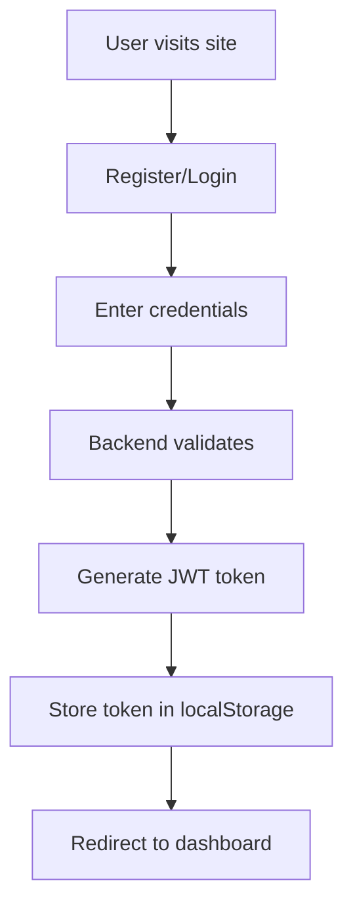
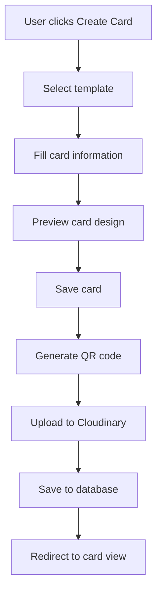
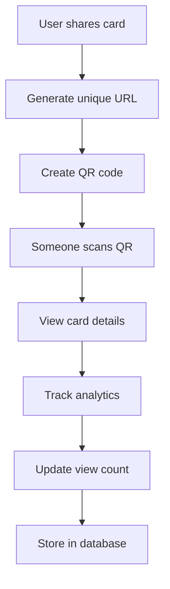
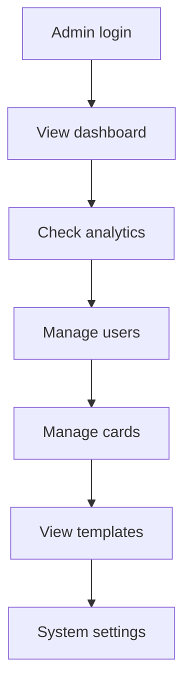

# 🎴 Cardly - Complete Project Guide

## 📋 Table of Contents
1. [Project Overview](#project-overview)
2. [System Architecture](#system-architecture)
3. [Technology Stack](#technology-stack)
4. [Database Schema](#database-schema)
5. [Authentication System](#authentication-system)
6. [QR Code Algorithm](#qr-code-algorithm)
7. [JWT SHA256 Algorithm](#jwt-sha256-algorithm)
8. [Frontend Architecture](#frontend-architecture)
9. [Backend Architecture](#backend-architecture)
10. [API Endpoints](#api-endpoints)
11. [Features & Workflows](#features--workflows)
12. [Admin Dashboard](#admin-dashboard)
13. [Cloudinary Integration](#cloudinary-integration)
14. [Security Features](#security-features)
15. [Deployment Guide](#deployment-guide)

---

## 🎯 Project Overview

**Cardly** is a modern, full-stack digital business card platform that allows users to create, share, and manage professional digital business cards. The platform provides a seamless experience for networking professionals, entrepreneurs, and businesses to showcase their information digitally.

### Key Highlights
- **Modern UI/UX**: Beautiful, responsive design with smooth animations
- **Real-time Preview**: Live card preview during creation
- **QR Code Generation**: Instant sharing via QR codes
- **Analytics**: Track card views and engagement
- **Template System**: Multiple professional templates
- **Admin Dashboard**: Comprehensive admin management
- **Mobile Optimized**: Perfect experience on all devices

---

## 🏗️ System Architecture

```
┌─────────────────┐    ┌─────────────────┐    ┌─────────────────┐
│   Frontend      │    │   Backend       │    │   Database      │
│   (React)       │◄──►│   (Node.js)     │◄──►│   (MongoDB)     │
│   Port: 5173    │    │   Port: 5050    │    │   Port: 27017   │
└─────────────────┘    └─────────────────┘    └─────────────────┘
         │                       │                       │
         │                       │                       │
         ▼                       ▼                       ▼
┌─────────────────┐    ┌─────────────────┐    ┌─────────────────┐
│   Cloudinary    │    │   JWT Auth      │    │   Collections   │
│   (CDN/Images)  │    │   (Security)    │    │   (Users/Cards) │
└─────────────────┘    └─────────────────┘    └─────────────────┘
```

### Data Flow
1. **User Registration/Login** → JWT Token Generation
2. **Card Creation** → Template Selection → Design Generation
3. **QR Code Generation** → Unique URL Creation
4. **Card Sharing** → Analytics Tracking
5. **Admin Management** → Real-time Dashboard

---

## 🛠️ Technology Stack

### Frontend
- **React 18**: Modern React with hooks and context
- **Vite**: Fast build tool and development server
- **Tailwind CSS**: Utility-first CSS framework
- **Redux Toolkit**: State management
- **React Router**: Client-side routing
- **Framer Motion**: Smooth animations
- **React Konva**: Canvas-based card rendering
- **React Hot Toast**: Modern notifications

### Backend
- **Node.js**: JavaScript runtime
- **Express.js**: Web application framework
- **MongoDB**: NoSQL database
- **Mongoose**: MongoDB object modeling
- **JWT**: Authentication and authorization
- **bcryptjs**: Password hashing
- **Cloudinary**: Image upload and storage
- **Winston**: Logging system

### DevOps & Tools
- **PM2**: Process management
- **Nginx**: Reverse proxy
- **Docker**: Containerization
- **Git**: Version control
- **ESLint**: Code linting
- **Jest**: Testing framework

---

## 🗄️ Database Schema

### User Collection
```javascript
{
  _id: ObjectId,
  username: String (unique),
  email: String (unique),
  password: String (hashed),
  name: String,
  isActive: Boolean,
  lastLoginAt: Date,
  createdAt: Date,
  updatedAt: Date
}
```

### Card Collection
```javascript
{
  _id: ObjectId,
  ownerUserId: ObjectId (ref: User),
  title: String,
  fullName: String,
  jobTitle: String,
  company: String,
  email: String,
  phone: String,
  website: String,
  address: String,
  bio: String,
  cardImage: String (Cloudinary URL),
  designJson: String (JSON),
  backgroundColor: String,
  textColor: String,
  fontFamily: String,
  shortLink: String (unique),
  qrCode: String (Cloudinary URL),
  isPublic: Boolean,
  templateId: String (ref: Template),
  featured: Boolean,
  views: Number,
  loveCount: Number,
  shares: Number,
  downloads: Number,
  loves: [ObjectId],
  createdAt: Date,
  updatedAt: Date
}
```

### Template Collection
```javascript
{
  _id: ObjectId,
  id: String (unique),
  name: String,
  description: String,
  category: String,
  tags: [String],
  preview: {
    backgroundColor: String,
    textColor: String,
    fontFamily: String,
    elements: [Object]
  },
  design: {
    backgroundColor: String,
    textColor: String,
    fontFamily: String,
    elements: [Object],
    layout: String,
    aspectRatio: String
  },
  isActive: Boolean,
  isFeatured: Boolean,
  usageCount: Number,
  createdBy: ObjectId (ref: Admin),
  createdAt: Date,
  updatedAt: Date
}
```

### Admin Collection
```javascript
{
  _id: ObjectId,
  username: String (unique),
  email: String (unique),
  password: String (hashed),
  role: String,
  isActive: Boolean,
  createdAt: Date,
  updatedAt: Date
}
```

---

## 🔐 Authentication System

### JWT Token Structure
```javascript
// Token Payload
{
  "userId": "507f1f77bcf86cd799439011",
  "email": "user@example.com",
  "role": "user",
  "iat": 1516239022,
  "exp": 1516325422
}

// Admin Token Payload
{
  "adminId": "507f1f77bcf86cd799439012",
  "email": "admin@cardly.com",
  "role": "admin",
  "iat": 1516239022,
  "exp": 1516325422
}
```

### Authentication Flow
1. **User Registration**
   ```javascript
   // Password hashing with bcrypt
   const hashedPassword = await bcrypt.hash(password, 12);
   
   // Create user
   const user = new User({
     username,
     email,
     password: hashedPassword,
     name
   });
   ```

2. **User Login**
   ```javascript
   // Verify password
   const isValidPassword = await bcrypt.compare(password, user.password);
   
   // Generate JWT token
   const token = jwt.sign(
     { userId: user._id, email: user.email, role: 'user' },
     process.env.JWT_SECRET,
     { expiresIn: '7d' }
   );
   ```

3. **Token Verification**
   ```javascript
   // Middleware for protected routes
   const authenticateToken = (req, res, next) => {
     const token = req.headers.authorization?.split(' ')[1];
     
     if (!token) {
       return res.status(401).json({ error: 'Access token required' });
     }
     
     jwt.verify(token, process.env.JWT_SECRET, (err, user) => {
       if (err) {
         return res.status(403).json({ error: 'Invalid token' });
       }
       req.user = user;
       next();
     });
   };
   ```

---

## 📱 QR Code Algorithm

### QR Code Generation Process

1. **Unique URL Creation**
   ```javascript
   // Generate unique short link
   const shortLink = `card-${Date.now()}-${Math.random().toString(36).substr(2, 9)}`;
   
   // Create card URL
   const cardUrl = `${process.env.FRONTEND_URL}/card/${shortLink}`;
   ```

2. **QR Code Generation**
   ```javascript
   // Using qrcode library
   import QRCode from 'qrcode';
   
   const generateQRCode = async (cardUrl) => {
     try {
       // Generate QR code as data URL
       const qrCodeDataUrl = await QRCode.toDataURL(cardUrl, {
         width: 300,
         margin: 2,
         color: {
           dark: '#000000',
           light: '#FFFFFF'
         }
       });
       
       return qrCodeDataUrl;
     } catch (error) {
       throw new Error('Failed to generate QR code');
     }
   };
   ```

3. **QR Code Upload to Cloudinary**
   ```javascript
   // Upload QR code to Cloudinary
   const uploadQRCode = async (qrCodeDataUrl) => {
     try {
       const result = await cloudinary.uploader.upload(qrCodeDataUrl, {
         folder: 'cardly_qr',
         width: 300,
         height: 300,
         crop: 'fill',
         quality: 'auto:best'
       });
       
       return result.secure_url;
     } catch (error) {
       throw new Error('Failed to upload QR code');
     }
   };
   ```

4. **Complete QR Code Process**
   ```javascript
   const createCardWithQR = async (cardData) => {
     // 1. Generate short link
     const shortLink = generateShortLink();
     
     // 2. Create card URL
     const cardUrl = `${process.env.FRONTEND_URL}/card/${shortLink}`;
     
     // 3. Generate QR code
     const qrCodeDataUrl = await generateQRCode(cardUrl);
     
     // 4. Upload to Cloudinary
     const qrCodeUrl = await uploadQRCode(qrCodeDataUrl);
     
     // 5. Save card with QR code
     const card = new Card({
       ...cardData,
       shortLink,
       qrCode: qrCodeUrl
     });
     
     await card.save();
     return card;
   };
   ```

### QR Code Features
- **Unique URLs**: Each card gets a unique short link
- **High Quality**: 300x300px QR codes with optimal contrast
- **Cloud Storage**: QR codes stored on Cloudinary CDN
- **Instant Sharing**: QR codes can be scanned immediately
- **Analytics Tracking**: Each QR scan is tracked for analytics

---

## 🔒 JWT SHA256 Algorithm

### JWT Token Creation
```javascript
// JWT Configuration
const JWT_SECRET = process.env.JWT_SECRET || 'your-super-secret-jwt-key';
const JWT_EXPIRES_IN = process.env.JWT_EXPIRES_IN || '7d';

// Token Generation
const generateToken = (payload) => {
  return jwt.sign(payload, JWT_SECRET, {
    expiresIn: JWT_EXPIRES_IN,
    algorithm: 'HS256' // SHA256 algorithm
  });
};

// User Token
const generateUserToken = (user) => {
  return generateToken({
    userId: user._id,
    email: user.email,
    role: 'user',
    username: user.username
  });
};

// Admin Token
const generateAdminToken = (admin) => {
  return generateToken({
    adminId: admin._id,
    email: admin.email,
    role: 'admin',
    username: admin.username
  });
};
```

### JWT Verification
```javascript
// Token Verification Middleware
const verifyToken = (req, res, next) => {
  try {
    const token = req.headers.authorization?.split(' ')[1];
    
    if (!token) {
      return res.status(401).json({ error: 'Access token required' });
    }
    
    // Verify token using SHA256
    const decoded = jwt.verify(token, JWT_SECRET, {
      algorithms: ['HS256']
    });
    
    req.user = decoded;
    next();
  } catch (error) {
    if (error.name === 'TokenExpiredError') {
      return res.status(401).json({ error: 'Token expired' });
    }
    if (error.name === 'JsonWebTokenError') {
      return res.status(401).json({ error: 'Invalid token' });
    }
    return res.status(500).json({ error: 'Token verification failed' });
  }
};

// Role-based Authorization
const requireRole = (role) => {
  return (req, res, next) => {
    if (req.user.role !== role) {
      return res.status(403).json({ error: 'Insufficient permissions' });
    }
    next();
  };
};
```

### Security Features
- **SHA256 Hashing**: Secure token signing
- **Token Expiration**: Automatic token expiration
- **Role-based Access**: Different permissions for users and admins
- **Refresh Tokens**: Optional refresh token implementation
- **Token Blacklisting**: Ability to invalidate tokens

---

## 🎨 Frontend Architecture

### Component Structure
```
frontend/src/
├── components/
│   ├── Auth/
│   │   ├── AuthInitializer.jsx
│   │   ├── ProtectedRoute.jsx
│   │   └── LoginForm.jsx
│   ├── Admin/
│   │   ├── AdminLayout.jsx
│   │   ├── AdminRoute.jsx
│   │   └── Dashboard/
│   ├── Cards/
│   │   ├── CardViewer.jsx
│   │   ├── CardCreator.jsx
│   │   └── CardList.jsx
│   ├── Layout/
│   │   ├── Header.jsx
│   │   ├── Footer.jsx
│   │   └── Navigation.jsx
│   └── Common/
│       ├── Modal.jsx
│       ├── Button.jsx
│       └── Loading.jsx
├── pages/
│   ├── Auth/
│   │   ├── LoginPage.jsx
│   │   └── RegisterPage.jsx
│   ├── Cards/
│   │   ├── AddCard.jsx
│   │   ├── EditCard.jsx
│   │   └── ViewCard.jsx
│   └── Admin/
│       ├── AdminDashboard.jsx
│       ├── UserManagement.jsx
│       └── AnalyticsDashboard.jsx
├── features/
│   ├── auth/
│   │   ├── authSlice.js
│   │   └── authThunks.js
│   ├── cards/
│   │   ├── cardsSlice.js
│   │   └── cardsThunks.js
│   └── admin/
│       ├── adminSlice.js
│       └── adminThunks.js
└── services/
    ├── apiService.js
    ├── authService.js
    └── cardService.js
```

### State Management (Redux)
```javascript
// Auth Slice
const authSlice = createSlice({
  name: 'auth',
  initialState: {
    user: null,
    isAuthenticated: false,
    loading: false,
    error: null
  },
  reducers: {
    setUser: (state, action) => {
      state.user = action.payload;
      state.isAuthenticated = !!action.payload;
    },
    setLoading: (state, action) => {
      state.loading = action.payload;
    },
    setError: (state, action) => {
      state.error = action.payload;
    },
    logout: (state) => {
      state.user = null;
      state.isAuthenticated = false;
    }
  }
});

// Cards Slice
const cardsSlice = createSlice({
  name: 'cards',
  initialState: {
    cards: [],
    selectedCard: null,
    loading: false,
    error: null
  },
  reducers: {
    setCards: (state, action) => {
      state.cards = action.payload;
    },
    addCard: (state, action) => {
      state.cards.push(action.payload);
    },
    updateCard: (state, action) => {
      const index = state.cards.findIndex(card => card._id === action.payload._id);
      if (index !== -1) {
        state.cards[index] = action.payload;
      }
    },
    deleteCard: (state, action) => {
      state.cards = state.cards.filter(card => card._id !== action.payload);
    }
  }
});
```

---

## 🖥️ Backend Architecture

### Directory Structure
```
backend/src/
├── app.js                 # Main application file
├── controllers/           # Request handlers
│   ├── authController.js
│   ├── cardController.js
│   ├── userController.js
│   └── adminController.js
├── models/               # Database models
│   ├── userModel.js
│   ├── cardModel.js
│   ├── templateModel.js
│   └── adminModel.js
├── routes/               # API routes
│   ├── authRoutes.js
│   ├── cardRoutes.js
│   ├── userRoutes.js
│   └── adminRoutes.js
├── services/             # Business logic
│   ├── authService.js
│   ├── cardService.js
│   ├── imageService.js
│   └── adminService.js
├── middleware/           # Custom middleware
│   ├── authMiddleware.js
│   ├── errorMiddleware.js
│   └── validationMiddleware.js
├── utils/               # Utility functions
│   ├── cloudinary.js
│   ├── logger.js
│   └── helpers.js
└── algorithms/          # Custom algorithms
    ├── qrCodeGenerator.js
    └── shortLinkGenerator.js
```

### Main Application Setup
```javascript
// app.js
const express = require('express');
const mongoose = require('mongoose');
const cors = require('cors');
const helmet = require('helmet');
const rateLimit = require('express-rate-limit');

const app = express();

// Security middleware
app.use(helmet());
app.use(cors({
  origin: process.env.ALLOWED_ORIGINS?.split(',') || ['http://localhost:5173'],
  credentials: true
}));

// Rate limiting
const limiter = rateLimit({
  windowMs: 15 * 60 * 1000, // 15 minutes
  max: 100 // limit each IP to 100 requests per windowMs
});
app.use('/api/', limiter);

// Body parsing
app.use(express.json({ limit: '10mb' }));
app.use(express.urlencoded({ extended: true }));

// Routes
app.use('/api/auth', authRoutes);
app.use('/api/cards', cardRoutes);
app.use('/api/users', userRoutes);
app.use('/api/admin', adminRoutes);

// Error handling
app.use(errorMiddleware);

// Database connection
mongoose.connect(process.env.DATABASE_URL, {
  useNewUrlParser: true,
  useUnifiedTopology: true
});

const PORT = process.env.PORT || 5050;
app.listen(PORT, () => {
  console.log(`Server running on port ${PORT}`);
});
```

---

## 🔌 API Endpoints

### Authentication Endpoints
```javascript
// POST /api/auth/register
{
  "username": "john_doe",
  "email": "john@example.com",
  "password": "securepassword",
  "name": "John Doe"
}

// POST /api/auth/login
{
  "email": "john@example.com",
  "password": "securepassword"
}

// POST /api/auth/admin/login
{
  "email": "admin@cardly.com",
  "password": "admin123"
}
```

### Card Endpoints
```javascript
// POST /api/cards
{
  "title": "John Doe - Software Engineer",
  "fullName": "John Doe",
  "jobTitle": "Software Engineer",
  "company": "Tech Corp",
  "email": "john@techcorp.com",
  "phone": "+(977) 98-123-4567",
  "website": "www.johndoe.com",
  "address": "123 Thamel Marg, Kathmandu, Nepal",
  "bio": "Experienced software engineer...",
  "templateId": "template-nepal-1",
  "isPublic": true
}

// GET /api/cards
// Returns user's cards with pagination

// GET /api/cards/:id
// Returns specific card details

// PUT /api/cards/:id
// Updates card information

// DELETE /api/cards/:id
// Deletes card
```

### Admin Endpoints
```javascript
// GET /api/admin/dashboard
// Returns dashboard statistics

// GET /api/admin/users
// Returns all users with pagination

// GET /api/admin/cards
// Returns all cards with pagination

// GET /api/admin/analytics
// Returns analytics data

// PUT /api/admin/users/:id
// Updates user information

// DELETE /api/admin/users/:id
// Deletes user
```

---

## 🎯 Features & Workflows

### 1. User Registration & Authentication


### 2. Card Creation Process


### 3. Card Sharing & Analytics


### 4. Admin Dashboard Workflow


---

## 🛠️ Admin Dashboard

### Dashboard Components
1. **Statistics Cards**
   - Total Users
   - Total Cards
   - Total Views
   - Revenue

2. **System Health**
   - Database Status
   - Server Status
   - API Status
   - Memory Usage

3. **Recent Activity**
   - User registrations
   - Card creations
   - Template updates
   - System events

4. **Popular Templates**
   - Usage statistics
   - Rating information
   - Featured status

### User Management
```javascript
// User listing with filters
const fetchUsers = async (filters) => {
  const params = new URLSearchParams({
    page: filters.page,
    limit: filters.limit,
    search: filters.search,
    status: filters.status,
    sortBy: filters.sortBy,
    sortOrder: filters.sortOrder
  });
  
  const response = await fetch(`/api/admin/users?${params}`, {
    headers: { 'Authorization': `Bearer ${adminToken}` }
  });
  
  return response.json();
};

// User actions
const handleUserAction = async (userId, action) => {
  const response = await fetch(`/api/admin/users/${userId}/${action}`, {
    method: 'POST',
    headers: { 'Authorization': `Bearer ${adminToken}` }
  });
  
  return response.json();
};
```

### Card Management
```javascript
// Card listing with analytics
const fetchCards = async (filters) => {
  const params = new URLSearchParams({
    page: filters.page,
    limit: filters.limit,
    search: filters.search,
    status: filters.status,
    sortBy: filters.sortBy,
    sortOrder: filters.sortOrder
  });
  
  const response = await fetch(`/api/admin/cards?${params}`, {
    headers: { 'Authorization': `Bearer ${adminToken}` }
  });
  
  return response.json();
};

// Card featuring
const featureCard = async (cardId) => {
  const response = await fetch(`/api/admin/cards/${cardId}/feature`, {
    method: 'POST',
    headers: { 'Authorization': `Bearer ${adminToken}` }
  });
  
  return response.json();
};
```

---

## ☁️ Cloudinary Integration

### Image Upload Process
```javascript
// Enhanced Cloudinary configuration
const cloudinaryConfig = {
  cloud_name: process.env.CLOUDINARY_CLOUD_NAME || 'demo',
  api_key: process.env.CLOUDINARY_API_KEY || 'demo',
  api_secret: process.env.CLOUDINARY_API_SECRET || 'demo'
};

// Upload function with optimization
const uploadToCloudinary = async (file, options = {}) => {
  try {
    const isConfigured = validateCloudinaryConfig();
    
    if (!isConfigured) {
      return {
        secure_url: 'https://via.placeholder.com/400x300/4F46E5/FFFFFF?text=Demo+Image',
        public_id: 'demo-image',
        width: 400,
        height: 300,
        format: 'jpg'
      };
    }

    const uploadOptions = {
      folder: 'cardly',
      resource_type: 'auto',
      transformation: [
        { quality: 'auto:good' },
        { fetch_format: 'auto' }
      ],
      ...options
    };

    const result = await cloudinary.uploader.upload(file, uploadOptions);
    return result;
  } catch (error) {
    throw new Error(`Failed to upload image: ${error.message}`);
  }
};
```

### Image Optimization
```javascript
// Profile photo upload
const uploadProfilePhoto = async (imageBuffer) => {
  return uploadToCloudinary(imageBuffer, {
    folder: 'cardly_profiles',
    width: 400,
    height: 400,
    crop: 'fill',
    gravity: 'face',
    quality: 'auto:good'
  });
};

// Card background upload
const uploadCardBackground = async (imageBuffer) => {
  return uploadToCloudinary(imageBuffer, {
    folder: 'cardly_backgrounds',
    width: 800,
    height: 600,
    crop: 'fill',
    quality: 'auto:good'
  });
};

// QR code upload
const uploadQRCode = async (qrCodeBuffer) => {
  return uploadToCloudinary(qrCodeBuffer, {
    folder: 'cardly_qr',
    width: 300,
    height: 300,
    crop: 'fill',
    quality: 'auto:best'
  });
};
```

---

## 🔒 Security Features

### Password Security
```javascript
// Password hashing with bcrypt
const hashPassword = async (password) => {
  const saltRounds = 12;
  return await bcrypt.hash(password, saltRounds);
};

// Password verification
const verifyPassword = async (password, hashedPassword) => {
  return await bcrypt.compare(password, hashedPassword);
};
```

### Input Validation
```javascript
// Joi validation schema
const cardValidationSchema = Joi.object({
  title: Joi.string().min(3).max(100).required(),
  fullName: Joi.string().min(2).max(100).required(),
  jobTitle: Joi.string().min(2).max(100).required(),
  company: Joi.string().min(2).max(100).required(),
  email: Joi.string().email().required(),
  phone: Joi.string().min(10).max(20).required(),
  website: Joi.string().uri().optional(),
  address: Joi.string().min(5).max(200).required(),
  bio: Joi.string().max(500).optional(),
  isPublic: Joi.boolean().default(true)
});
```

### Rate Limiting
```javascript
// API rate limiting
const limiter = rateLimit({
  windowMs: 15 * 60 * 1000, // 15 minutes
  max: 100, // limit each IP to 100 requests per windowMs
  message: 'Too many requests from this IP, please try again later.'
});

app.use('/api/', limiter);
```

### CORS Protection
```javascript
// CORS configuration
app.use(cors({
  origin: process.env.ALLOWED_ORIGINS?.split(',') || ['http://localhost:5173'],
  credentials: true,
  methods: ['GET', 'POST', 'PUT', 'DELETE', 'OPTIONS'],
  allowedHeaders: ['Content-Type', 'Authorization']
}));
```

---

## 🚀 Deployment Guide

### Environment Variables
```bash
# Database
DATABASE_URL=mongodb://localhost:27017/cardly

# JWT
JWT_SECRET=your-super-secret-jwt-key-change-this-in-production
JWT_EXPIRES_IN=7d

# Cloudinary
CLOUDINARY_CLOUD_NAME=your-cloud-name
CLOUDINARY_API_KEY=your-api-key
CLOUDINARY_API_SECRET=your-api-secret

# Server
PORT=5050
NODE_ENV=production

# CORS
ALLOWED_ORIGINS=https://yourdomain.com,https://www.yourdomain.com

# Frontend
FRONTEND_URL=https://yourdomain.com
```

### Production Build
```bash
# Frontend build
cd frontend
npm run build

# Backend start
cd backend
npm start
```

### PM2 Configuration
```javascript
// ecosystem.config.js
module.exports = {
  apps: [{
    name: 'cardly-backend',
    script: 'src/app.js',
    instances: 'max',
    exec_mode: 'cluster',
    env: {
      NODE_ENV: 'production',
      PORT: 5050
    },
    error_file: './logs/err.log',
    out_file: './logs/out.log',
    log_file: './logs/combined.log',
    time: true
  }]
};
```

### Nginx Configuration
```nginx
server {
    listen 80;
    server_name yourdomain.com;

    # Frontend
    location / {
        root /var/www/cardly/frontend/dist;
        try_files $uri $uri/ /index.html;
    }

    # Backend API
    location /api {
        proxy_pass http://localhost:5050;
        proxy_http_version 1.1;
        proxy_set_header Upgrade $http_upgrade;
        proxy_set_header Connection 'upgrade';
        proxy_set_header Host $host;
        proxy_cache_bypass $http_upgrade;
    }
}
```

---

## 📊 Analytics & Monitoring

### Analytics Tracking
```javascript
// Card view tracking
const trackCardView = async (cardId, viewerInfo) => {
  try {
    await Card.findByIdAndUpdate(cardId, {
      $inc: { views: 1 },
      $push: {
        viewHistory: {
          timestamp: new Date(),
          ip: viewerInfo.ip,
          userAgent: viewerInfo.userAgent,
          referrer: viewerInfo.referrer
        }
      }
    });
  } catch (error) {
    console.error('Failed to track card view:', error);
  }
};

// Engagement tracking
const trackEngagement = async (cardId, action) => {
  try {
    const updateField = action === 'love' ? 'loveCount' : 
                       action === 'share' ? 'shares' : 
                       action === 'download' ? 'downloads' : null;
    
    if (updateField) {
      await Card.findByIdAndUpdate(cardId, {
        $inc: { [updateField]: 1 }
      });
    }
  } catch (error) {
    console.error('Failed to track engagement:', error);
  }
};
```

### Real-time Analytics
```javascript
// Dashboard analytics
const getDashboardStats = async () => {
  const stats = {
    totalUsers: await User.countDocuments(),
    totalCards: await Card.countDocuments(),
    totalViews: await Card.aggregate([
      { $group: { _id: null, totalViews: { $sum: '$views' } } }
    ]),
    recentActivity: await getRecentActivity(),
    popularTemplates: await getPopularTemplates()
  };
  
  return stats;
};
```

---

## 🎨 Template System

### Template Structure
```javascript
const templateExample = {
  id: 'template-nepal-1',
  name: 'Nepal Traditional',
  category: 'Traditional',
  description: 'Beautiful traditional Nepali design',
  preview: {
    backgroundColor: '#ffffff',
    elements: [
      {
        type: 'Text',
        x: 60,
        y: 100,
        text: '{{fullName}}',
        fontSize: 24,
        fontFamily: 'Arial',
        color: '#1f2937',
        fontWeight: 'bold'
      },
      {
        type: 'Text',
        x: 60,
        y: 130,
        text: '{{jobTitle}}',
        fontSize: 16,
        fontFamily: 'Arial',
        color: '#6b7280'
      },
      {
        type: 'Text',
        x: 60,
        y: 160,
        text: '{{email}}',
        fontSize: 14,
        fontFamily: 'Arial',
        color: '#374151'
      }
    ]
  },
  design: {
    backgroundColor: '#ffffff',
    elements: [
      // Same elements as preview but with full positioning
    ]
  }
};
```

### Template Rendering
```javascript
// Template element mapping
const renderTemplate = (template, cardData) => {
  return template.elements.map(element => {
    if (element.type === 'Text') {
      let text = element.text;
      
      // Replace placeholders with actual data
      if (text === '{{fullName}}') text = cardData.fullName;
      else if (text === '{{jobTitle}}') text = cardData.jobTitle;
      else if (text === '{{company}}') text = cardData.company;
      else if (text === '{{email}}') text = cardData.email;
      else if (text === '{{phone}}') text = cardData.phone;
      else if (text === '{{website}}') text = cardData.website;
      else if (text === '{{address}}') text = cardData.address;
      else if (text === '{{bio}}') text = cardData.bio;
      
      return {
        ...element,
        text
      };
    }
    
    return element;
  });
};
```

---

## 🔧 Custom Algorithms

### Short Link Generator
```javascript
const generateShortLink = () => {
  const timestamp = Date.now().toString(36);
  const random = Math.random().toString(36).substr(2, 9);
  return `card-${timestamp}-${random}`;
};
```

### QR Code Optimization
```javascript
const optimizeQRCode = (url, options = {}) => {
  const defaultOptions = {
    width: 300,
    margin: 2,
    color: {
      dark: '#000000',
      light: '#FFFFFF'
    },
    errorCorrectionLevel: 'M',
    ...options
  };
  
  return QRCode.toDataURL(url, defaultOptions);
};
```

### Image Processing
```javascript
const processImage = async (imageBuffer, options = {}) => {
  const {
    width = 800,
    height = 600,
    quality = 80,
    format = 'jpeg'
  } = options;

  let sharpInstance = sharp(imageBuffer);

  // Resize image
  sharpInstance = sharpInstance.resize(width, height, {
    fit: 'inside',
    withoutEnlargement: true
  });

  // Convert to specified format and optimize
  switch (format.toLowerCase()) {
    case 'jpeg':
    case 'jpg':
      sharpInstance = sharpInstance.jpeg({ quality });
      break;
    case 'png':
      sharpInstance = sharpInstance.png({ quality });
      break;
    case 'webp':
      sharpInstance = sharpInstance.webp({ quality });
      break;
    default:
      sharpInstance = sharpInstance.jpeg({ quality });
  }

  return await sharpInstance.toBuffer();
};
```

---

## 📱 Mobile Responsiveness

### Responsive Design Features
- **Flexible Grid System**: Uses Tailwind CSS grid and flexbox
- **Mobile-First Approach**: Design starts with mobile and scales up
- **Touch-Friendly Interface**: Large buttons and touch targets
- **Optimized Images**: Responsive images with proper sizing
- **Progressive Web App**: Can be installed on mobile devices

### Breakpoint Strategy
```css
/* Mobile (default) */
.container { padding: 1rem; }

/* Tablet (md: 768px) */
@media (min-width: 768px) {
  .container { padding: 2rem; }
}

/* Desktop (lg: 1024px) */
@media (min-width: 1024px) {
  .container { padding: 3rem; }
}
```

---

## 🧪 Testing Strategy

### Unit Tests
```javascript
// Auth service tests
describe('AuthService', () => {
  test('should hash password correctly', async () => {
    const password = 'testpassword';
    const hashedPassword = await hashPassword(password);
    expect(hashedPassword).not.toBe(password);
  });

  test('should verify password correctly', async () => {
    const password = 'testpassword';
    const hashedPassword = await hashPassword(password);
    const isValid = await verifyPassword(password, hashedPassword);
    expect(isValid).toBe(true);
  });
});
```

### Integration Tests
```javascript
// API endpoint tests
describe('Card API', () => {
  test('should create card successfully', async () => {
    const cardData = {
      title: 'Test Card',
      fullName: 'John Doe',
      jobTitle: 'Developer',
      company: 'Test Corp',
      email: 'john@test.com'
    };

    const response = await request(app)
      .post('/api/cards')
      .set('Authorization', `Bearer ${token}`)
      .send(cardData);

    expect(response.status).toBe(201);
    expect(response.body).toHaveProperty('_id');
  });
});
```

---

## 🚀 Performance Optimization

### Frontend Optimization
- **Code Splitting**: Lazy loading of components
- **Image Optimization**: WebP format with fallbacks
- **Caching**: Browser caching for static assets
- **Minification**: Compressed JavaScript and CSS
- **CDN**: Cloudinary for image delivery

### Backend Optimization
- **Database Indexing**: Proper MongoDB indexes
- **Query Optimization**: Efficient database queries
- **Caching**: Redis for session storage
- **Compression**: Gzip compression for responses
- **Rate Limiting**: API rate limiting

### Monitoring
```javascript
// Performance monitoring
const performanceMiddleware = (req, res, next) => {
  const start = Date.now();
  
  res.on('finish', () => {
    const duration = Date.now() - start;
    console.log(`${req.method} ${req.path} - ${duration}ms`);
  });
  
  next();
};
```

---

## 🔄 Data Flow Summary

### Complete User Journey
1. **Registration**: User creates account → JWT token generated
2. **Login**: User authenticates → Token stored in localStorage
3. **Card Creation**: User fills form → Template applied → QR code generated
4. **Card Sharing**: QR code scanned → Analytics tracked → View count updated
5. **Admin Management**: Admin monitors → Analytics reviewed → Users managed

### Technical Flow
1. **Frontend Request** → React component dispatches action
2. **Redux Thunk** → API call to backend
3. **Backend Route** → Controller handles request
4. **Service Layer** → Business logic processing
5. **Database** → MongoDB operation
6. **Response** → Data returned to frontend
7. **State Update** → Redux store updated
8. **UI Update** → Component re-renders

---

## 📈 Future Enhancements

### Planned Features
- **Real-time Chat**: Live messaging between users
- **Advanced Analytics**: Detailed user behavior tracking
- **Template Marketplace**: User-generated templates
- **API Integration**: Third-party service connections
- **Mobile App**: Native iOS/Android applications
- **AI Features**: Smart card recommendations
- **Multi-language**: Internationalization support
- **Advanced Security**: Two-factor authentication

### Scalability Considerations
- **Microservices**: Break down into smaller services
- **Load Balancing**: Distribute traffic across servers
- **Database Sharding**: Horizontal database scaling
- **CDN Expansion**: Global content delivery
- **Caching Strategy**: Redis and Memcached
- **Monitoring**: Advanced logging and alerting

---

## 🎯 Conclusion

Cardly is a comprehensive digital business card platform that demonstrates modern web development practices. The system includes:

- **Secure Authentication**: JWT with SHA256 algorithm
- **QR Code Generation**: Unique URLs with analytics tracking
- **Real-time Analytics**: Comprehensive user engagement metrics
- **Admin Dashboard**: Full platform management capabilities
- **Responsive Design**: Mobile-first approach
- **Cloud Integration**: Cloudinary for image management
- **Production Ready**: Scalable architecture with security features

The platform successfully combines frontend and backend technologies to create a seamless user experience for digital business card creation and sharing.

---

**Built with ❤️ using React, Node.js, MongoDB, and Cloudinary** 